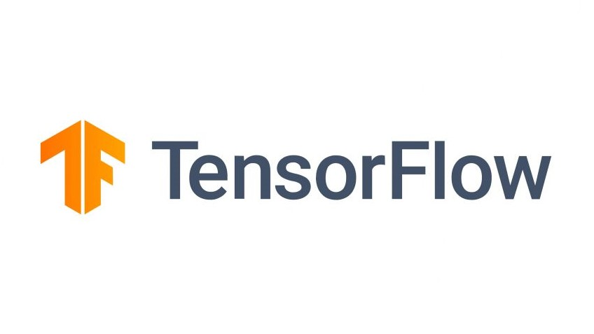

# Underdog Chess AI Project

___

Copyright © 2024 RandomKiddo

A chess AI project built with Tensorflow Functional Interface and deployed with FastAPI for Python 3.10. 
___

### Table of Contents

1. [About](#about)
2. [Learning Goals](#learning-goals)
3. [Models and Results](#models-and-results)
4. [The Engine](#the-engine)
5. [Outcomes](#outcomes)
6. [Acknowledgements](#acknowledgements)

___

### About

This project is a chess AI project. It uses Tensorflow to create a convolutional neural network and a residual neural network, using its inbuilt functional interface. The project uses Stockfish as a "ground truth", meaning that Stockfish is used to evaluate positions when compiling the dataset, but Stockfish is *not* used to decide which move to select next. Because of this design decision, our model cannot realistically beat Stockfish (ignoring the fact that Stockfish is one of the most powerful chess engine available for public use to date). Our personal metric for evaluating how good our engine is lies with how long our model can hold out against Stockfish or induce draws and stalemates. 

The project was deployed using FastAPI. Its interface was also designed using FastAPI.

This project is licensed using the MIT License, Copyright © 2024 RandomKiddo.
For more information, see [this link](https://opensource.org/license/mit) or [this Wikipedia article](https://en.wikipedia.org/wiki/MIT_License).

___

### Learning Goals

The learning goals for this project were as follows:

* Deepen understanding of convolutional and residual neural networks
* Increase comfortability using `.npz` files and `.keras` files
* Become better accustomed using virtual environments
* Better ability of fine-tuning CNN and RNN models and parameters
* Learn about and employ minimax algorithms 
* Finish first project involving FastAPI AI deployment
* Employ better file tree management practices and `.gitignore` management

___

### Models and Results

:warning: Under Construction :hammer:

___

### The Engine

:warning: Under Construction :hammer:

___

### Outcomes

:warning: Under Construction :hammer:

___

### Acknowledgements

We acknowledge the use of the following Python packages (in no particular order):
* Tensorflow
* Keras
* Numpy
* Python-Chess
* Uvicorn
* FastAPI
* Pydantic
* Jupyter

___

This page was last edited on 05.01.2024

[Back to Top](#underdog-chess-ai-project)